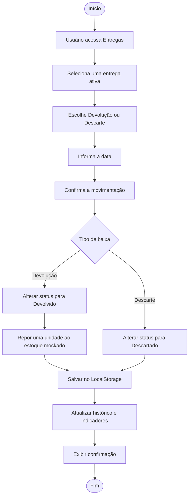

# Diagrama de Atividade — Devolução ou descarte

Este diagrama representa o fluxo implementado no protótipo do CP5 para o RF04.

```mermaid
flowchart TD
    A([Início]) --> B[Usuário acessa Entregas]
    B --> C[Seleciona uma entrega ativa]
    C --> D[Escolhe Devolução ou Descarte]
    D --> E[Informa a data]
    E --> F[Confirma a movimentação]
    F --> G{Tipo de baixa}
    G -- Devolução --> H[Alterar status para Devolvido]
    H --> I[Repor uma unidade ao estoque mockado]
    G -- Descarte --> J[Alterar status para Descartado]
    I --> K[Salvar no LocalStorage]
    J --> K
    K --> L[Atualizar histórico e indicadores]
    L --> M[Exibir confirmação]
    M --> N([Fim])
```
