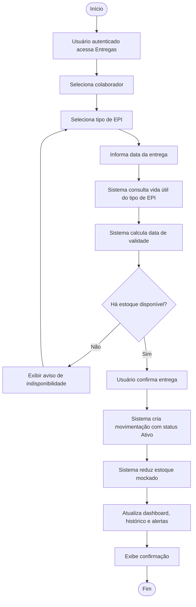

# Diagrama de Atividade — Registro de entrega de EPI

Este diagrama representa o fluxo implementado no protótipo do CP5 para o RF03.

```mermaid
flowchart TD
    A([Início]) --> B[Usuário autenticado acessa Entregas]
    B --> C[Seleciona colaborador]
    C --> D[Seleciona tipo de EPI]
    D --> E[Informa data da entrega]
    E --> F[Sistema consulta vida útil do tipo de EPI]
    F --> G[Sistema calcula data de validade]
    G --> H{Há estoque disponível?}
    H -- Não --> I[Exibir aviso de indisponibilidade]
    I --> D
    H -- Sim --> J[Usuário confirma entrega]
    J --> K[Sistema cria movimentação com status Ativo]
    K --> L[Sistema reduz estoque mockado]
    L --> M[Atualiza dashboard, histórico e alertas]
    M --> N[Exibe confirmação]
    N --> O([Fim])
```
