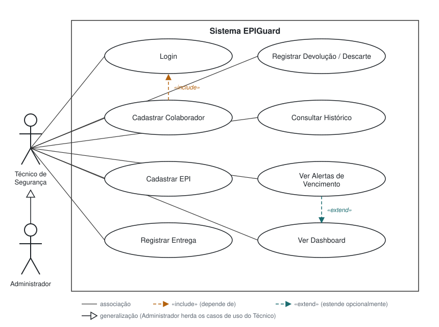
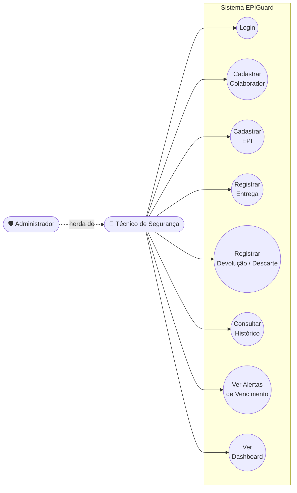

# Diagrama de Caso de Uso — EPIGuard

Dois atores, oito casos de uso principais, dentro da fronteira do sistema, com relações `«include»` (Cadastrar Colaborador depende de Login) e `«extend»` (Ver Alertas de Vencimento estende opcionalmente Ver Dashboard).

## Revisão do CP5

No CP4 o Colaborador era um ator: fazia login, registrava a própria retirada e consultava o histórico. Durante a construção do protótipo o grupo simplificou o fluxo (ver [jornada](../jornada.md)):

- **Colaborador** deixa de ser ator. Ele é uma entidade cadastrada, vinculada às entregas — aparece no [diagrama de classes](classes.md), não aqui.
- **Administrador** entra como segundo ator, ligado ao Técnico de Segurança por generalização: tudo o que o Técnico faz, o Administrador também faz. No CP5 os dois perfis têm as mesmas permissões; a diferenciação fica para o CP6.
- **Registrar Devolução** passa a cobrir também o descarte.

## Versão rápida (mermaid, sem notação UML formal)

Útil só para conferência rápida de quais atores acessam quais casos de uso — o diagrama acima é a versão oficial em notação UML.

