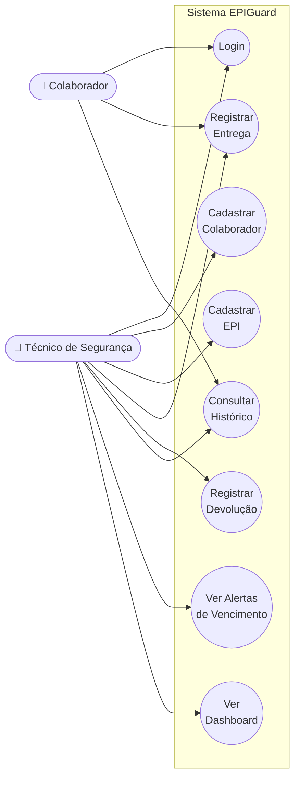

# Diagrama de Caso de Uso — EPIGuard

Dois atores, oito casos de uso principais. Base para o diagrama de classes (CP5) e para os diagramas de sequência dos fluxos de Entrega e Alerta (CP5).

> Para o entregável do CP4 (imagem no README/documentação), renderize este bloco mermaid num visualizador (GitHub renderiza `.md` com mermaid automaticamente) ou exporte como PNG para `docs/diagramas/caso-de-uso.png`.
