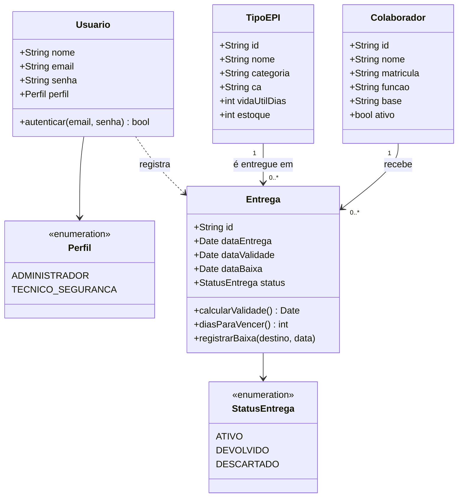

# Diagrama de Classes — EPIGuard

Modelo de domínio do protótipo do CP5. Corresponde às estruturas mockadas em `src/app.js` (`collaborators`, `epis`, `deliveries` e os usuários de demonstração) e serve de base para a modelagem do banco de dados no CP6.

## Notas

- **Colaborador** não é usuário do sistema: é apenas cadastrado e vinculado às entregas (decisão do CP5, ver [jornada](../jornada.md)).
- **Entrega** concentra a regra principal: `dataValidade = dataEntrega + TipoEPI.vidaUtilDias`. Os alertas saem de `diasParaVencer()` sobre as entregas com status `ATIVO`.
- A baixa por **devolução** repõe uma unidade no estoque do `TipoEPI`; a baixa por **descarte** não repõe.
- No protótipo o `Usuario` é fixo no código e a entrega ainda não guarda quem a registrou; a associação `registra` passa a ser persistida no CP6, junto com a autenticação real.
