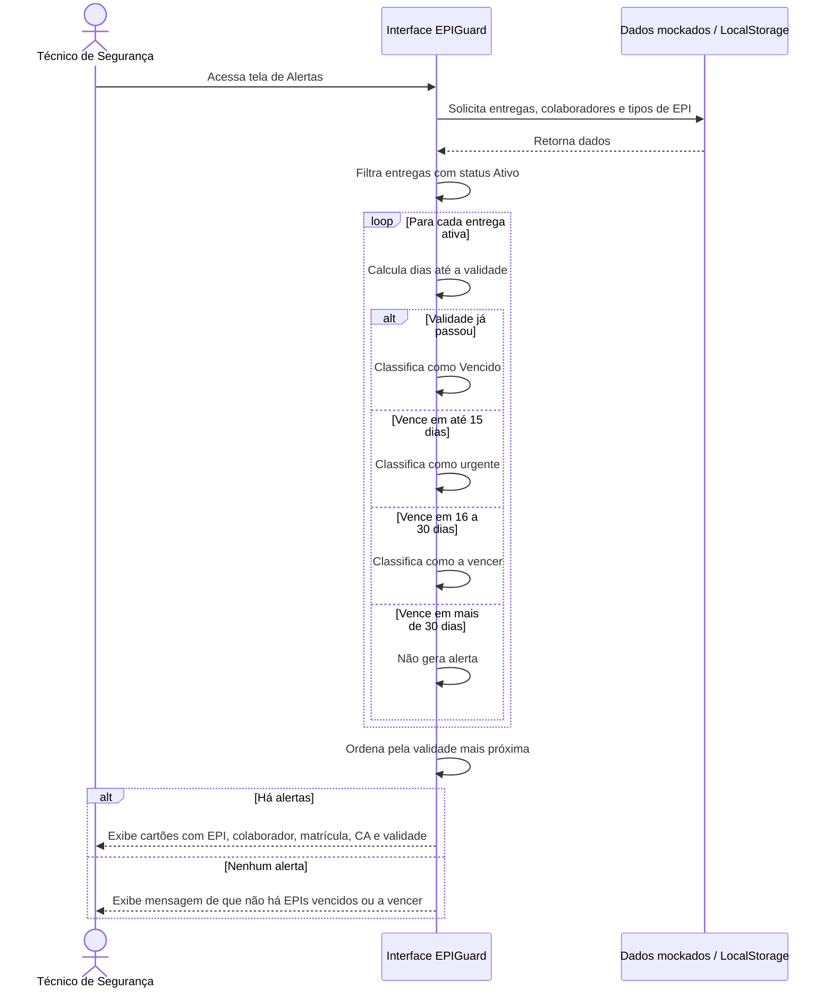

# Diagrama de Sequência — Alertas de vencimento

Fluxo correspondente ao RF05 no protótipo funcional. Os alertas não são armazenados: são recalculados a partir das entregas ativas sempre que a tela é exibida.

