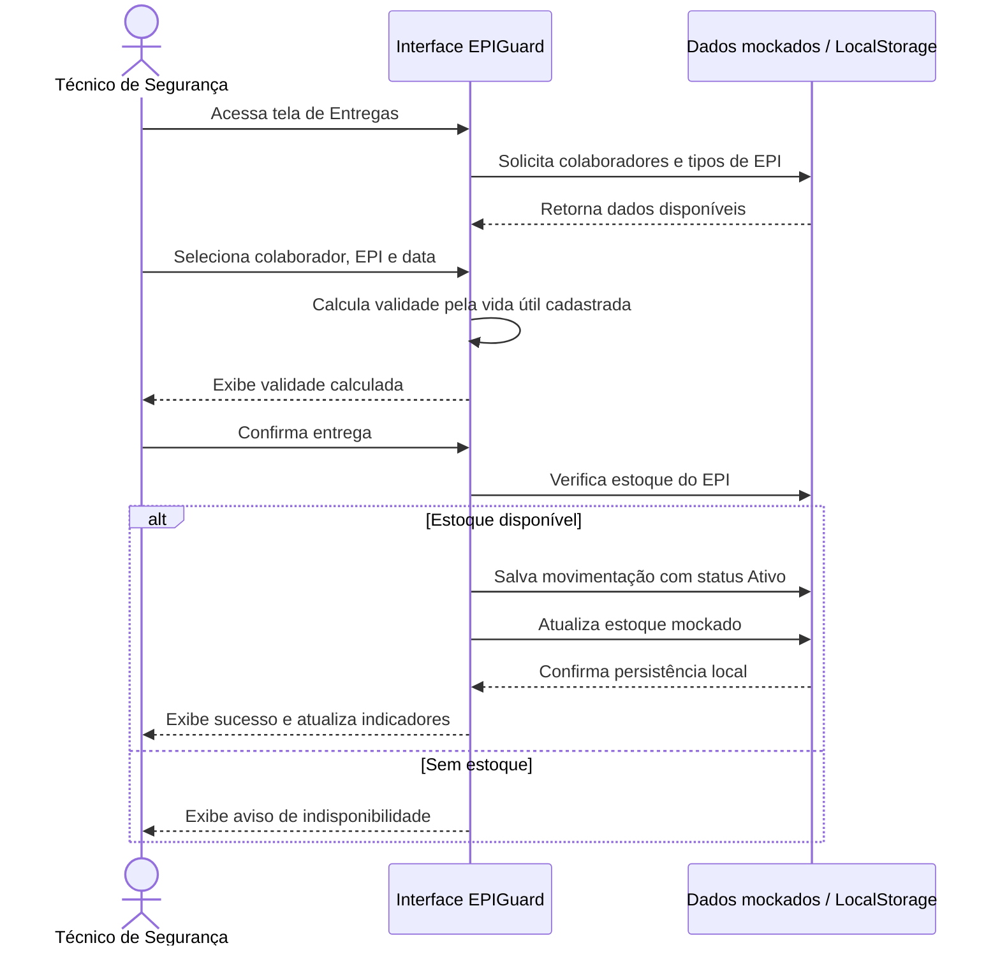

# Diagrama de Sequência — Registro de entrega de EPI

Fluxo correspondente ao RF03 no protótipo funcional.

```mermaid
sequenceDiagram
    actor T as Técnico de Segurança
    participant UI as Interface EPIGuard
    participant LS as Dados mockados / LocalStorage

    T->>UI: Acessa tela de Entregas
    UI->>LS: Solicita colaboradores e tipos de EPI
    LS-->>UI: Retorna dados disponíveis
    T->>UI: Seleciona colaborador, EPI e data
    UI->>UI: Calcula validade pela vida útil cadastrada
    UI-->>T: Exibe validade calculada
    T->>UI: Confirma entrega
    UI->>LS: Verifica estoque do EPI
    alt Estoque disponível
        UI->>LS: Salva movimentação com status Ativo
        UI->>LS: Atualiza estoque mockado
        LS-->>UI: Confirma persistência local
        UI-->>T: Exibe sucesso e atualiza indicadores
    else Sem estoque
        UI-->>T: Exibe aviso de indisponibilidade
    end
```
